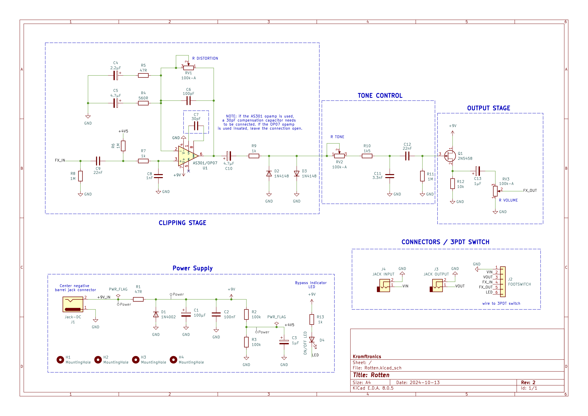
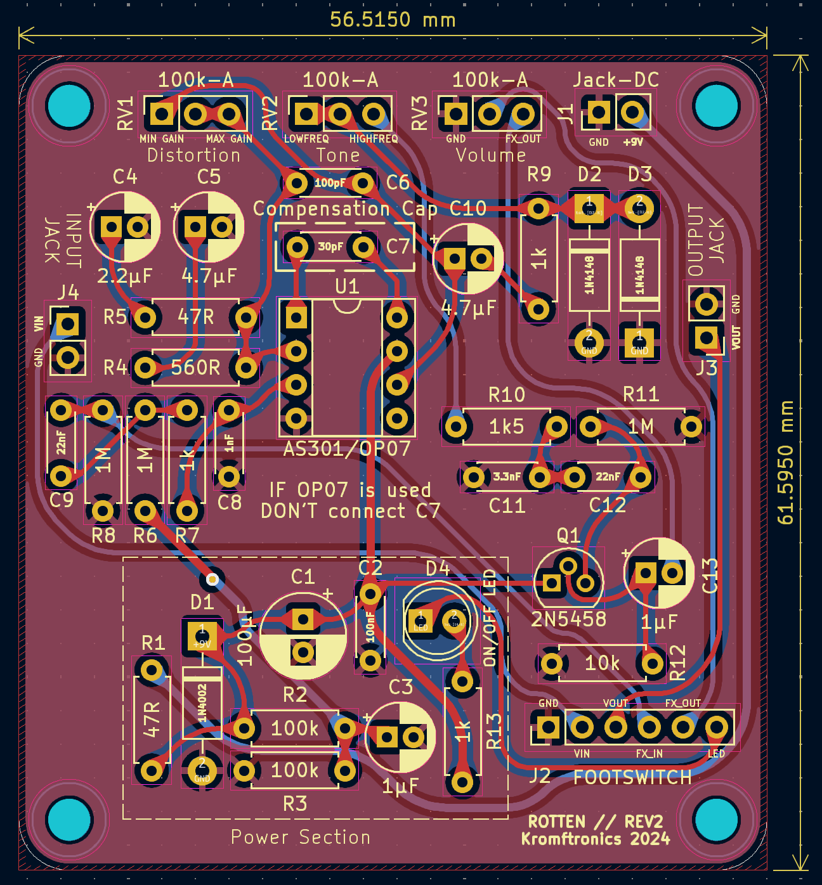
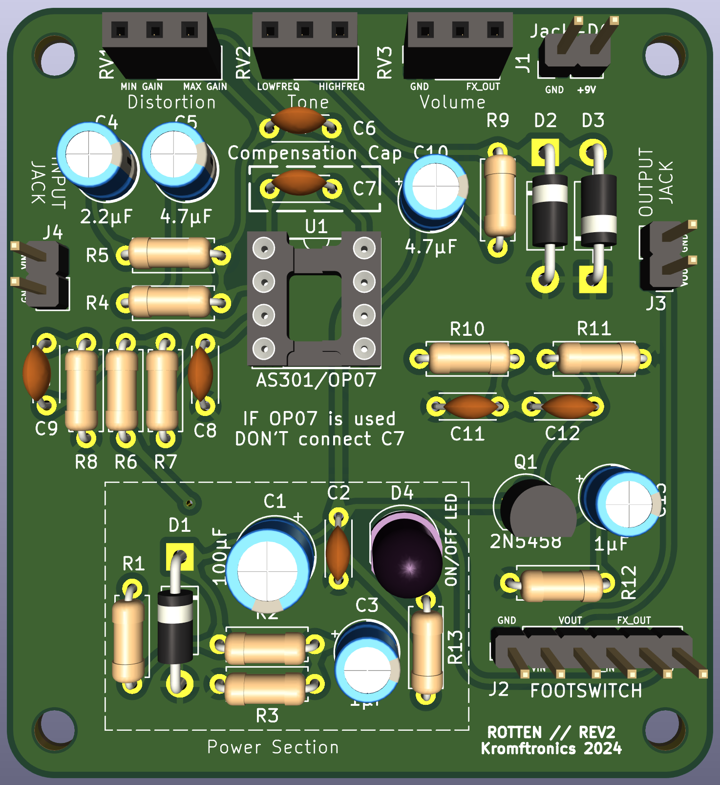
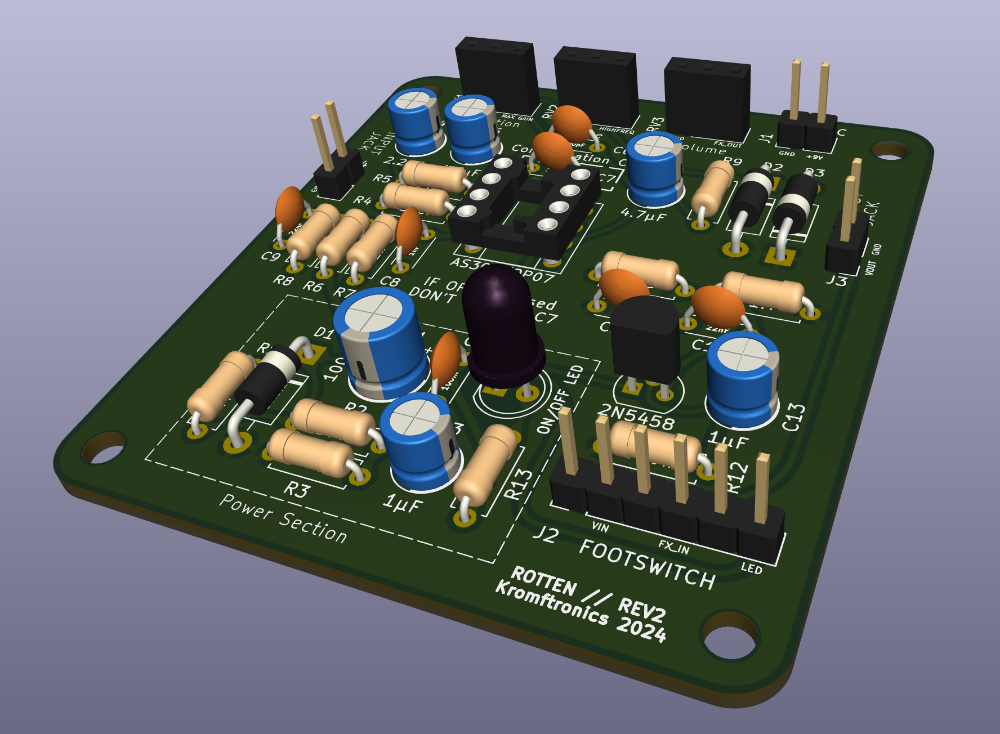
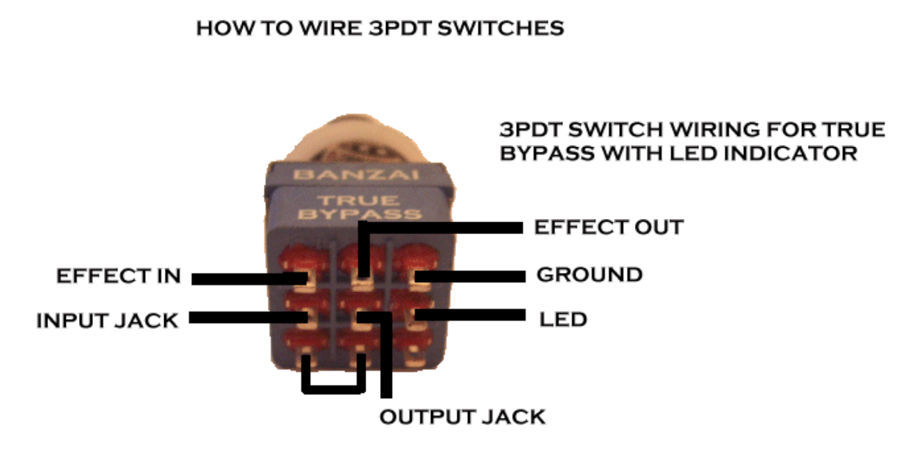
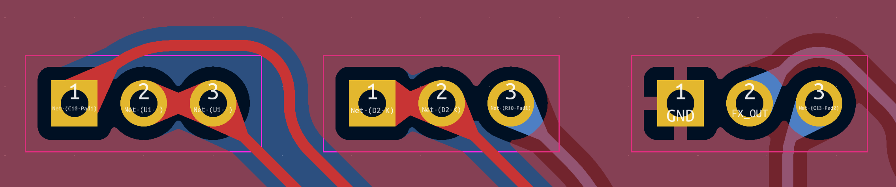
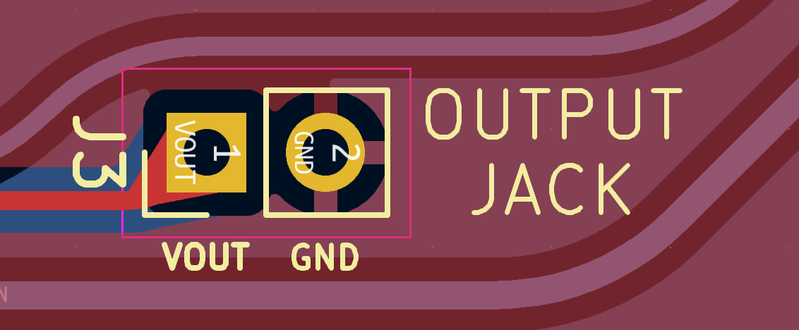

# Rotten - DIY Pro Co RAT Clone
This repository contains the KiCad files for a DIY clone of the classic Pro Co RAT distortion effect pedal.
The schematic is an implementation of the one found on [ElectroSmash](https://www.electrosmash.com/proco-rat), so a big shout-out to them.
The article on [ElectroSmash](https://www.electrosmash.com/proco-rat) has a great description of the functionality of the circuit.

## Interactive BOM
An [interactive HTML BOM](https://html-preview.github.io/?url=https://github.com/KamikazeVildsvin/Rotten/blob/master/PCB/Rotten/bom/ibom.html) can be found in the `PCB/Rotten/bom` directory.
This can be used as a tool to easier populate the PCB.

## Images
### Schematic

### PCB

### 3D Model

# Wiring
## Footswitch - True Bypass Wiring
You will need a 3PDT type switch in order to wire things correctly. 
The six connections on the PCB needs to be wired to the switch as indicated by the image below.

*source: https://support.banzaimusic.com/article/53-true-bypass-switch-wiring*

I would recommend that you use the interactive BOM above to see what connection on the PCB matches the correct pin on the footswitch, since the silkscreen is very small and probably not readable on the actual physical PCB.

*NOTE*: If you don't want to use the LED indicator, you can disregard the **GROUND** and **LED** connections on the footswitch and don't solder these connections to the PCB.

## Potentiometers
The PCB has been designed so pin 1, 2, and 3 on the board matches the pinout of the 100k Potentiometers.
This means that pin 1 on the potentiometer should go to the square pad on the PCB, as indicated below.

## Jack Connectors
The Jack connectors (both the 1/4" audio jacks and the DC jack) only needs two connections.
For the audio jacks, pin 1 should be soldered to the tib of the connector and the sleeve to pin 2.
The silkscreen on the PCB also indicates which pad is ground or the signal, as can be seen below

The DC barrek jack needs to be connected center negatic in order for the effect to work with standard stompbox power supplies.
This means that you should connect the tip to ground and the **+9V** to the sleeve of the barrel jack connector.