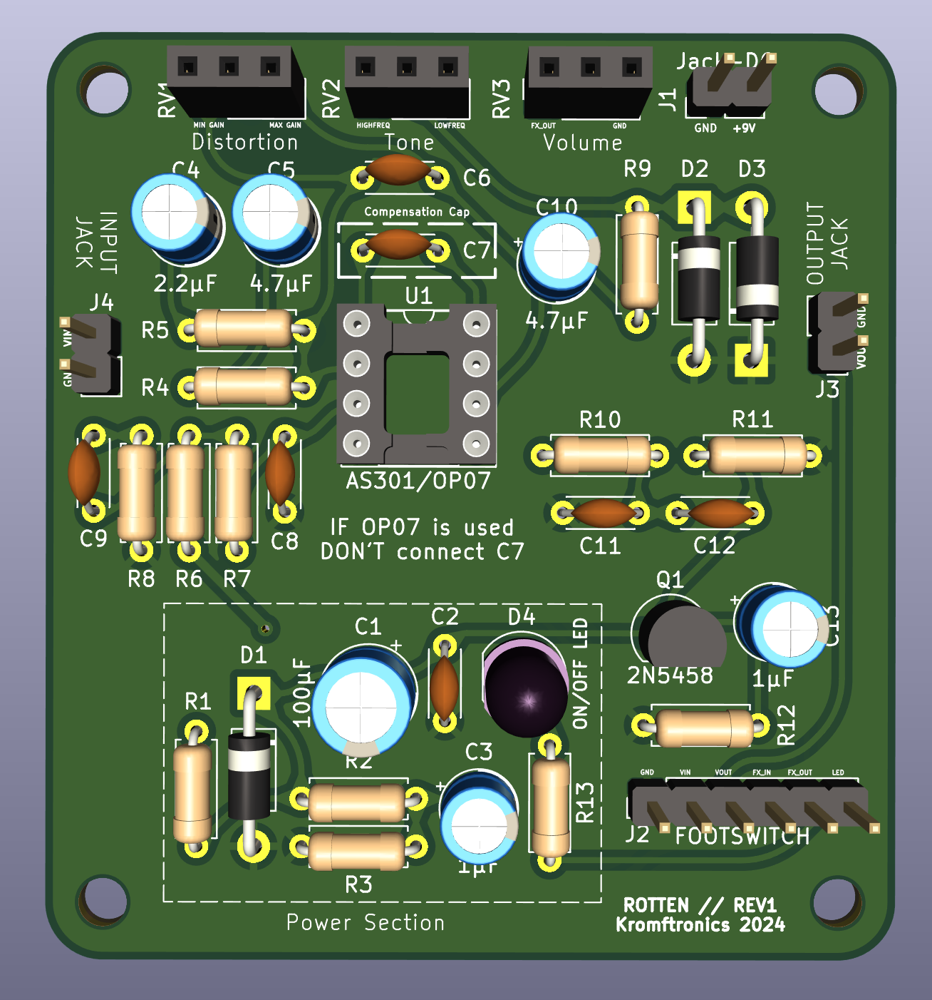
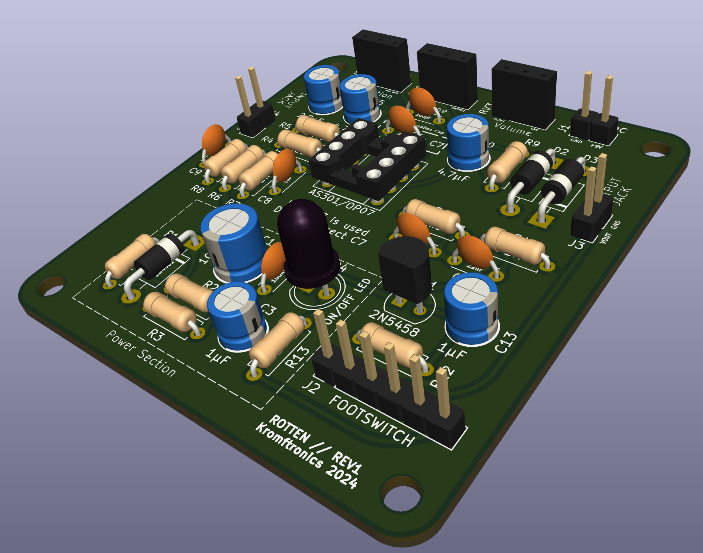

# Rotten - DIY Pro Co RAT Clone
This repository contains the KiCad files for a DIY clone of the classic Pro Co RAT distortion effect pedal.
The schematic is an implementation of the one found on [ElectroSmash](https://www.electrosmash.com/proco-rat), so a big shout-out to them.
The article on [ElectroSmash](https://www.electrosmash.com/proco-rat) has a great description of the functionality of the circuit.

## REV1 Images
### Schematic

### PCB

### 3D Model

