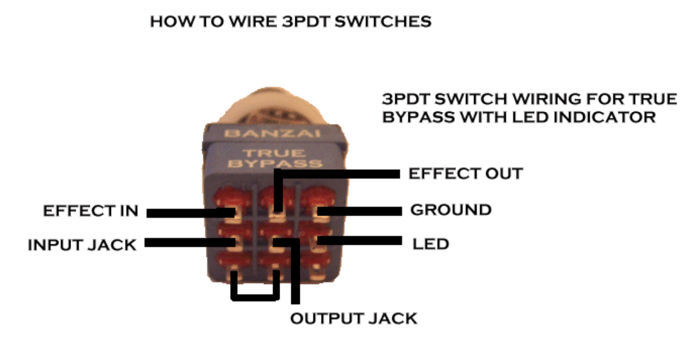

# Rotten - DIY Pro Co RAT Clone
This repository contains the KiCad files for a DIY clone of the classic Pro Co RAT distortion effect pedal.
The schematic is an implementation of the one found on [ElectroSmash](https://www.electrosmash.com/proco-rat), so a big shout-out to them.
The article on [ElectroSmash](https://www.electrosmash.com/proco-rat) has a great description of the functionality of the circuit.

*NOTE*: 

The current version of the circuit has a wrong implementation of the LED circuit, which means that it won't light up. 
It doesn't affect the performance of the audio.
The pins of the volume potentiometer also needs to be reversed in order for the volume to be all the way down when the potentiometer is turn fully counter-clockwise.

## Interactive BOM
An [interactive HTML BOM](https://html-preview.github.io/?url=https://github.com/KamikazeVildsvin/Rotten/blob/master/PCB/Rotten/bom/ibom.html) can be found in the `PCB/Rotten/bom` directory.
This can be used as a tool to easier populate the PCB.

## REV1 Images
### Schematic

### PCB

### 3D Model

# Footswitch - True Bypass Wiring
You will need a 3PDT type switch in order to wire things correctly. 
The six connections on the PCB needs to be wired to the switch as indicated by the image below.

*source: https://support.banzaimusic.com/article/53-true-bypass-switch-wiring*

I would recommend that you use the interactive BOM above to see what connection on the PCB matches the correct pin on the footswitch, since the silkscreen is very small and probably not readable on the actual physical PCB.

*NOTE*: If you don't want to use the LED indicator, you can disregard the **GROUND** and **LED** connections on the footswitch and don't solder these connections to the PCB.